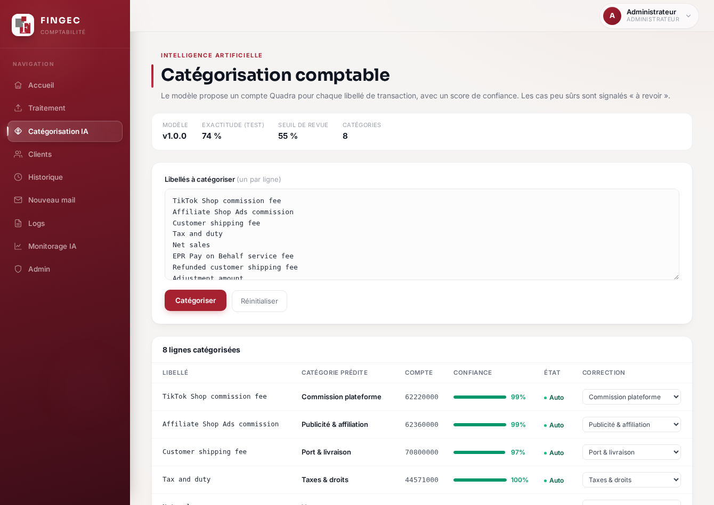
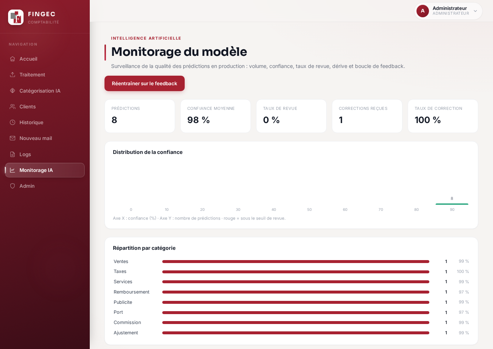
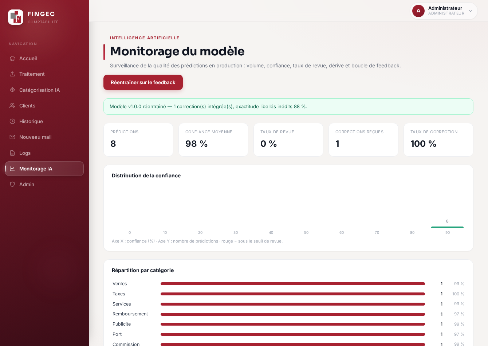

# DOSSIER PROFESSIONNEL

> ⚠️ **À LIRE AVANT DE RENDRE.** Ce document est un **brouillon complet** à
> mettre en forme dans Word et surtout à **reformuler avec tes propres mots** :
> le dossier passe un anti-plagiat **et un détecteur d'IA**. Garde la structure
> et les faits, réécris les phrases. Mets la forme imposée : **Calibri/Arial 12,
> interligne 1,5, justifié**, sommaire **cliquable et numéroté**, **50-70 pages
> hors annexes**, attestation anti-plagiat **en dernière page**. Nomme le PDF
> `BILE-KouameJohan-2026.pdf`.

---

## Page de garde

**BILE Kouamé Johan Paul-Marie**

**Dossier Professionnel**

Titre visé : **Développeur en Intelligence Artificielle** — RNCP 37827

Promotion : **2025 / 2026**

École : **[À COMPLÉTER : EPSI / Simplon]**

Entreprise : **Fingec — Cabinet d'expertise comptable**

Tuteur entreprise / référent : **N'KATTA Ohouo Christian**

Responsable de formation : **[À COMPLÉTER]**

Logos : **[À INSÉRER : logo école + logo Fingec]**

---

## Remerciements

Je remercie **N'KATTA Ohouo Christian** ainsi que l'équipe du cabinet **Fingec**
pour leur accompagnement durant mon stage, [À COMPLÉTER : personnaliser]. Je
remercie également l'équipe pédagogique de **[École]** [À COMPLÉTER].

---

## Sommaire

*(À générer automatiquement dans Word — sommaire cliquable et numéroté.)*

1. Introduction
2. Environnement professionnel
3. Valorisation des compétences
   - 3.1 E1 — Collecte, stockage et mise à disposition des données (C1-C5)
   - 3.2 E2 — Veille, benchmark et service d'IA (C6-C8)
   - 3.3 E3 — API du modèle, intégration, monitorage, tests, CI/CD (C9-C13)
   - 3.4 E4 — Application intégrant un service d'IA (C14-C19)
   - 3.5 E5 — Monitorage applicatif et résolution d'incident (C20-C21)
4. Conclusion
5. Annexes
6. Attestation de non-plagiat

---

## 1. Introduction

Je m'appelle **BILE Kouamé Johan Paul-Marie**, candidat au titre **Développeur en
Intelligence Artificielle** (RNCP 37827). [À COMPLÉTER : 2-3 phrases sur ton
parcours et ta motivation pour l'IA/la data.]

J'ai réalisé mon stage au sein du cabinet d'expertise comptable **Fingec**, où
j'ai conçu et déployé une **application d'automatisation comptable** destinée à
préparer les écritures à partir des relevés de plateformes e-commerce (TikTok
Shop, Shopify) jusqu'à un export prêt pour le logiciel **Quadra**.

Ce projet unique couvre les **trois blocs de compétences** du titre : il
**collecte et expose des données** (bloc 1), il **intègre un modèle
d'intelligence artificielle** de catégorisation comptable (bloc 2), et il
constitue une **application complète** déployée en production, monitorée et
maintenue (bloc 3). Le présent dossier valorise mes compétences épreuve par
épreuve, en m'appuyant sur des réalisations concrètes, versionnées et en ligne
(`app.fingec.fr`).

---

## 2. Environnement professionnel

### 2.1 L'entreprise

**Fingec** est un **cabinet d'expertise comptable** [À COMPLÉTER : taille,
localisation, clientèle — notamment des e-commerçants]. Son activité consiste à
tenir et réviser la comptabilité de ses clients, dont une part vend en ligne via
des marketplaces (TikTok Shop, Shopify).

**Problématique métier :** la préparation des écritures e-commerce est
**chronophage et répétitive** — télécharger les relevés, ventiler chaque montant
(ventes, commissions, port, taxes, remboursements…) sur le bon compte, équilibrer
et importer dans Quadra. D'où le besoin d'un **outil d'automatisation**.

### 2.2 Mes missions

[À COMPLÉTER : reformuler]. Ma mission principale a été de **concevoir,
développer et déployer** l'application d'automatisation comptable, de bout en
bout : collecte des données, traitement et contrôle qualité, **brique
d'intelligence artificielle**, interface web, et mise en production (CI/CD,
monitorage).

### 2.3 Cartographie du système d'information

L'application repose sur l'architecture suivante :

- **Frontend** : application web **React + TypeScript** (build Vite), servie par
  Nginx.
- **Backend** : API **FastAPI (Python)**, authentification par cookie httpOnly +
  JWT.
- **Orchestration** : **n8n** (webhooks) pour les échanges avec **Google Sheets**
  (référentiel clients, historique) et l'envoi d'e-mails.
- **Données** : base **SQLite** (utilisateurs, attributions, journal des
  prédictions IA, feedback, taux de change).
- **IA** : modèle de catégorisation comptable (scikit-learn), servi par l'API.
- **Infrastructure** : conteneurs **Docker** sur un **VPS Hostinger**, reverse
  proxy **Caddy** (HTTPS), **CI/CD GitHub Actions**.
- **Observabilité** : Sentry, Uptime Kuma, journalisation applicative.

> *(Insérer ici le schéma d'architecture — voir annexes.)*

---

## 3. Valorisation des compétences

### 3.1 E1 — Collecte, stockage et mise à disposition des données (C1-C5)

#### Contexte
L'application doit **rassembler des données hétérogènes** et les rendre
exploitables : relevés de plateformes, référentiel clients, et taux de change
pour les ventes en devises.

#### C1 — Automatiser l'extraction depuis plusieurs sources
J'ai mis en place un **flux d'extraction multi-sources** :
- **Fichiers** : import des relevés **TikTok (.xlsx)** et **Shopify (.csv)** ;
  lecture ciblée de la feuille `Statements` / `Order details` (module
  `processor.py`, fonction `load_file`).
- **API REST** : récupération du référentiel clients et de l'historique depuis
  **Google Sheets** via des **webhooks n8n**, relayés par le backend après
  vérification du jeton (proxy authentifié).
- **Scraping web** : récupération quotidienne des **taux de change de la Banque
  centrale européenne** — téléchargement de la page HTML puis **parsing** du
  tableau des devises (module `scraper.py`, fonctions `fetch_rates` /
  `parse_rates_html`), avec gestion des erreurs et **point de lancement
  planifié** au démarrage de l'application.
- **Base de données** : lecture des données stockées en SQLite.

Le code est **versionné sur Git** et le scraping comprend un point de lancement,
l'initialisation des dépendances, la gestion des erreurs et la sauvegarde des
résultats en base.

#### C2 — Requêtes SQL d'extraction
Les données sont interrogées en **SQL** : agrégats de monitorage (`GROUP BY`,
`AVG`, sous-requête `MAX` — module `ai/store.py`), récupération du dernier jeu de
taux (`scraper.py`, `latest_rates`), et lecture filtrée des utilisateurs et
attributions. Les requêtes sont **paramétrées** (anti-injection).

#### C3 — Agrégation, nettoyage, homogénéisation
Le module `processor.py` **nettoie** les relevés (normalisation des colonnes,
typage numérique, suppression des lignes vides), **détecte les anomalies**
(7 règles : valeurs manquantes, ventes négatives, incohérence des totaux, TVA
incohérente, valeurs aberrantes par MAD/z-score, doublons, dates futures) et
calcule un **score de fiabilité**. Pour l'IA, j'**homogénéise** les libellés
(casse, ponctuation) lors de la construction du jeu d'entraînement.

#### C4 — Créer la base de données (Merise, RGPD)
J'ai modélisé la base selon la méthode **Merise** (MCD/MPD — voir annexe et
`docs/DP-modele-donnees-merise.md`). Tables : `users`, `client_assignments`,
`password_tokens`, `ai_predictions`, `ai_feedback`, `exchange_rates`. Choix
**RGPD** : mots de passe (bcrypt) et jetons (SHA-256) jamais en clair, **purge
automatique** des données (conservation limitée), registre des traitements
(`legal/`). Les tables sont créées **idempotemment** au démarrage.

#### C5 — API REST d'exposition
L'API **FastAPI** expose les données et traitements (`/process`, `/download`,
`/api/clients`, `/api/rates`…), documentée automatiquement en **OpenAPI**
(`/docs`), sécurisée par authentification et autorisation par rôle.

**Livrable E1 :** rapport présentant le flux automatisé, les requêtes de
nettoyage, la création de la base et l'exposition par API.

---

### 3.2 E2 — Veille, benchmark et service d'IA (C6-C8)

#### C6 — Veille technique et réglementaire
J'ai mené une veille hebdomadaire (≈ 1 h, lecteur RSS + newsletters + dépôts
GitHub) sur trois axes : **ML/NLP** (scikit-learn, Hugging Face), **MLOps**
(MLflow, DVC), et **réglementaire** (CNIL, **AI Act**, RGPD appliqué aux données
comptables). [À COMPLÉTER : 2-3 synthèses datées.] Conclusions ayant orienté le
projet : choix d'un **modèle léger et auto-hébergé** (RGPD, sobriété) et maintien
d'un **humain dans la boucle** (transparence AI Act).

#### C7 — Benchmark de services d'IA
J'ai comparé trois options pour la catégorisation des libellés (détail dans
`docs/DP-E2-veille-benchmark.md`) :
- **A. Modèle maison** (TF-IDF + régression logistique) — *retenu* : auto-hébergé
  (RGPD), interprétable, coût ~0, rapide, réentraînable ;
- **B. LLM via API** (GPT/Claude) : puissant mais données envoyées à un tiers,
  coût par appel, non déterministe ;
- **C. SaaS comptable/OCR** (Dext, Pennylane) : clé en main mais boîte noire,
  abonnement, peu de contrôle/monitorage.

La grille pondérée (RGPD, coût, contrôle, sobriété en tête) **désigne la solution
A**. Le LLM reste une piste d'amélioration en repli sur les cas ambigus.

#### C8 — Paramétrer le service d'IA
Le modèle est **intégré comme service interne** : dépendances installées,
entraînement **packagé au build Docker**, configuration par variables
d'environnement (`AI_REVIEW_THRESHOLD`, chemins d'artefacts), accès cloisonné
(monitorage/réentraînement réservés à l'admin), exposé en **API REST** et
**monitoré**.

**Livrable E2 :** rapport professionnel individuel (veille, benchmark, mise en
place du service).

---

### 3.3 E3 — API du modèle, intégration, monitorage, tests, CI/CD (C9-C13)

C'est le **cœur du projet IA**.

#### Problème et solution
Chaque composante d'une transaction (commission, port, taxe, remboursement,
ajustement…) doit être imputée au **bon compte Quadra**. Les règles fixes cassent
dès qu'un nouveau type de frais apparaît. J'ai donc développé un **modèle de
classification** qui prédit le compte à partir du **libellé** de la composante,
avec un **score de confiance**, et renvoie en **revue humaine** les cas peu sûrs.

#### Le modèle
- **Jeu de données par weak supervision** : à partir du vocabulaire réel des
  relevés (libellés des 62 colonnes de `Order details`, équivalents Shopify) +
  variantes **FR et EN**, augmenté de bruit réaliste (module `ai/dataset.py`).
  Procédé **déterministe** (graine fixe) donc reproductible.
- **Pipeline** : vectorisation **TF-IDF** (mots + caractères) → **régression
  logistique** multinomiale (`ai/train.py`).
- **Évaluation honnête** : **split par groupe** (aucune variante d'un libellé de
  test vue à l'entraînement) + **jeu de holdout** de libellés inédits écrits à la
  main, **matrice de confusion**, accuracy et F1 macro consignés dans
  `metrics.json` (versionné). Le holdout (~0,8) est volontairement réaliste : un
  score parfait trahirait une fuite de données.
- **Inférence** (`ai/model.py`) : renvoie compte + confiance + drapeau « à
  revoir » + alternatives ; face à l'inconnu, le modèle **signale** au lieu
  d'inventer.

**Résultats mesurés** (jeu de test par groupe) : accuracy **0,77**, F1 macro
**0,79**, exactitude sur libellés inédits (holdout) **0,81**. Matrice de
confusion (lignes = classe réelle, colonnes = classe prédite) :

| réel \ prédit | Vent | Port | Comm | Pub | Serv | Tax | Remb | Ajus |
|---|---|---|---|---|---|---|---|---|
| **Ventes** | 33 | 0 | 0 | 0 | 0 | 0 | 7 | 1 |
| **Port** | 0 | 24 | 1 | 0 | 7 | 0 | 0 | 0 |
| **Commission** | 0 | 0 | 22 | 0 | 0 | 0 | 0 | 0 |
| **Publicité** | 1 | 0 | 0 | 28 | 0 | 0 | 0 | 0 |
| **Services** | 0 | 6 | 0 | 19 | 15 | 0 | 0 | 0 |
| **Taxes** | 0 | 0 | 0 | 0 | 0 | 8 | 0 | 0 |
| **Remboursement** | 0 | 6 | 0 | 0 | 0 | 0 | 35 | 0 |
| **Ajustement** | 10 | 0 | 1 | 0 | 0 | 0 | 1 | 41 |

> Lecture : la diagonale (bonnes prédictions) domine. Les confusions résiduelles
> sont **interprétables** (ex. « Services » parfois pris pour « Publicité »,
> libellés proches) — d'où l'intérêt du **seuil de revue** qui renvoie ces cas au
> comptable. *(À reformuler et commenter en soutenance.)*

#### C9 — API REST du modèle
Routeur `/api/ai` (`ai/api.py`) : `categorize`, `categorize-batch`, `feedback`,
`categories`, doc **OpenAPI**, sécurité **OWASP API** (authentification
obligatoire, taille des entrées bornée, erreurs 401/422/503 propres).

#### C10 — Intégration dans l'application
Écran **« Catégorisation IA »** (React) : l'utilisateur saisit des libellés et
obtient pour chacun le compte proposé, une barre de **confiance**, et peut
**corriger** via un menu.

*Figure 1 — Écran « Catégorisation IA » : pour chaque libellé, le compte Quadra
proposé, le score de confiance et la possibilité de corriger (boucle de feedback).*

#### C11 — Monitorage du modèle
**Tableau de bord « Monitorage IA »** (admin) : volume de prédictions, confiance
moyenne, **taux de revue**, histogramme de confiance, **dérive** (confiance
moyenne par jour), nombre de corrections. Chaque prédiction est **journalisée**
(`ai/store.py`). C'est le « vecteur de restitution des métriques » attendu.

*Figure 2 — Tableau de bord « Monitorage IA » (admin) : volume, confiance
moyenne, taux de revue, distribution de la confiance et répartition par compte.*

#### C12 — Tests automatisés
**19 tests** (`tests/test_ai_model.py`, `tests/test_ai_api.py`) : reproductibilité
du jeu de données, **plancher de généralisation**, contrat d'inférence, revue sur
faible confiance, authentification, validation, **cloisonnement admin**,
réentraînement. Suite backend totale : **121 tests verts**.

#### C13 — Chaîne de livraison continue du modèle (MLOps)
- **Boucle de feedback** : les corrections du comptable sont stockées puis
  **réinjectées au réentraînement** (`/api/ai/retrain`, rechargement à chaud).
  Mesuré : une correction a fait progresser le holdout (0,875 → 0,9375).

  
  *Figure 3 — Réentraînement du modèle sur les corrections, déclenché depuis le
  tableau de bord ; les nouvelles métriques sont affichées après l'opération.*
- **Packaging** : le modèle est **entraîné au build de l'image Docker**
  (`RUN python -m ai.train`) → artefact versionné et reproductible.
- **CI/CD** : pipeline GitHub Actions multi-étapes (lint, tests, **entraînement +
  vérification du seuil de qualité du modèle**, builds Docker, e2e), puis
  déploiement automatique en production.

**Livrable E3 :** rapport + démonstration (API du modèle, application enrichie,
livraison continue).

---

### 3.4 E4 — Application intégrant un service d'IA (C14-C19)

#### C14 — Analyse du besoin
Besoin : automatiser la préparation comptable e-commerce. J'ai formalisé des
**user stories** (détail dans `docs/DP-E4-userstories-methode.md`), par exemple :
*« En tant que comptable, je veux que l'IA propose le compte de chaque ligne afin
de gagner du temps de ventilation »*. Objectifs d'**accessibilité** : contrastes,
libellés de formulaire, navigation clavier (standard **RGAA/WCAG**). [À COMPLÉTER
: audit d'accessibilité.]

#### C15 — Cadre technique
Architecture **n-tiers** : front React, back FastAPI, base SQLite, orchestration
n8n, conteneurs Docker. Choix justifiés par la simplicité d'exploitation et la
maîtrise RGPD (auto-hébergement VPS).

#### C16 — Coordination / méthode
**Git / GitHub**, **trunk-based** (une branche par fonctionnalité, fusion rapide),
**CI/CD** à chaque push, livraison par incréments vérifiés en production.
[À COMPLÉTER : outils/rituels de l'entreprise.]

#### C17 — Composants et interfaces
Développement des interfaces (connexion, traitement, clients, **catégorisation
IA**, **monitorage**), des **composants métier** (calcul TVA, génération du
journal Quadra en partie double équilibrée — `journal.py`), de la **gestion des
droits** (rôles admin/comptable, attribution des clients), et de la **sécurité**
(httpOnly, JWT, OWASP).

#### C18 — Tests automatisés du code
Tests **backend (pytest)** et **end-to-end (Playwright)**, exécutés en **CI** à
chaque push/PR.

#### C19 — Livraison continue
Workflow `deploy.yml` : **gate de tests** → rsync vers le VPS →
`docker compose up --build` → **healthcheck**. Déploiement automatique et
reproductible.

**Livrable E4 :** rapport + démonstration de l'application.

---

### 3.5 E5 — Monitorage applicatif et résolution d'incident (C20-C21)

#### C20 — Surveiller l'application
Dispositif : **CI** (tests à chaque push), **Sentry** (erreurs runtime),
**Uptime Kuma** (disponibilité), **journalisation** (`observability.py`), et la
**boucle de feedback** du modèle. Des **alertes** sont configurées (e-mail/push).

#### C21 — Résolution d'un incident
**Incident réel** (détail dans `docs/DP-E5-incident.md`) : après la refonte de la
page de connexion, **3 tests end-to-end** d'authentification ont échoué.
- **Diagnostic** : reproduit en local ; les **sélecteurs** des tests pointaient
  sur des libellés modifiés (titre « Connexion » → « Bon retour ! », politique de
  mot de passe 8 → 12 caractères). Le code applicatif était correct : c'était la
  **couverture de tests** qui était périmée.
- **Résolution** : mise à jour des sélecteurs (`auth.spec.ts`).
- **Vérification** : **6/6 tests au vert**, correctif **versionné** et **rejoué
  en CI** ; j'ai de plus **ajouté le job E2E au pipeline** pour prévenir la
  récidive.

**Livrable E5 :** documentation du monitorage et de la résolution de l'incident.

---

## 4. Conclusion

[À COMPLÉTER : reformuler et personnaliser.]

- **L'entreprise et ses perspectives** : Fingec dispose désormais d'un outil
  d'automatisation déployé qui réduit la saisie manuelle [À COMPLÉTER].
- **Le service et ses évolutions** : pistes — LLM en repli sur les libellés
  ambigus, OCR de factures (façon Dext), import direct dans Quadra, extension à
  d'autres plateformes.
- **Apports professionnels et personnels** : [À COMPLÉTER : ce que tu as appris —
  IA appliquée, MLOps, mise en production, rigueur des tests, etc.]

---

## 5. Annexes

- Schéma d'architecture du SI. *(à dessiner)*
- MCD / MPD Merise (cf. `DP-modele-donnees-merise.md`).
- Captures **déjà intégrées** dans E3 : Catégorisation IA (Figure 1), Monitorage
  IA (Figure 2), Réentraînement (Figure 3) — fichiers dans `docs/images/`.
- Matrice de confusion du modèle (intégrée dans E3) + `metrics.json`.
- Extraits de code clés (modèle, API, scraping).
- Liens : dépôt GitHub, application `app.fingec.fr`.

> **Captures qu'il te reste à prendre toi-même** (depuis le site live `app.fingec.fr`,
> connecté en admin, et depuis GitHub) — pour illustrer les autres épreuves :
> - **E1** : écran « Traitement » (import d'un relevé + score de fiabilité + journal Quadra).
> - **E3/E9** : page de doc **OpenAPI** `app.fingec.fr/docs` (le contrat de l'API).
> - **E3/C13 + E4** : le **graphe du pipeline CI** (onglet Actions → un run « CI » →
>   capture du graphe des jobs) et le **run de déploiement**.
> - **E4** : vue d'ensemble de l'app (sidebar + une page).
> - **E5** : tableau de bord de monitoring (Uptime Kuma / Sentry) et la sortie
>   verte des 6 tests e2e.

---

## 6. Attestation de non-plagiat

*(À placer en dernière page — modèle fourni : `EPSI - DEVIADS Attestation de
Non-plagiat EPSI.docx`.)*

« Je soussigné(e) **BILE Kouamé Johan Paul-Marie** atteste que ce dossier est le
fruit de mon travail personnel… » [À COMPLÉTER avec le modèle officiel, daté et
signé.]
