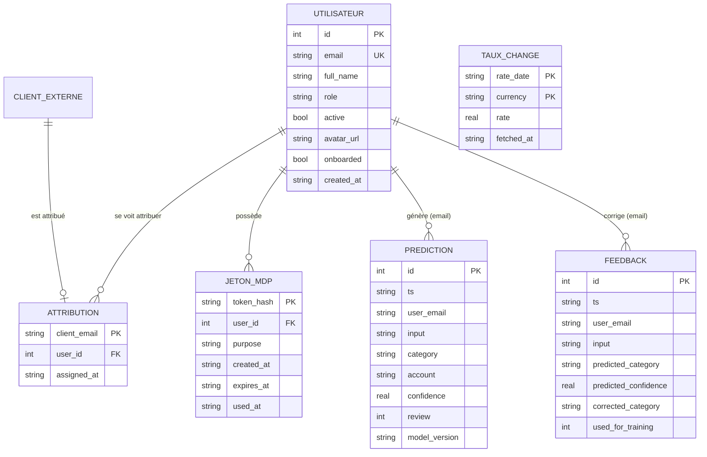

# Modèle de données Fingec — Merise (MCD / MPD)

> Pour le DP (compétence **C4 — Créer une base de données** : modèles conceptuel
> et physique selon Merise, dans le respect du RGPD). Base **SQLite** (`app.db`),
> sqlite3 stdlib, sans ORM.

## 1. Périmètre

La base persiste : les **utilisateurs** (admin/comptables), l'**attribution des
clients** aux comptables, les **jetons** de mot de passe, le **journal des
prédictions** du modèle IA, les **corrections** (feedback) et les **taux de
change** scrapés.

> Note : les **clients** eux-mêmes ne vivent pas dans cette base mais dans
> **Google Sheets** (orchestré par n8n) ; ils sont référencés ici par leur
> e-mail (entité externe).

## 2. MCD — Modèle Conceptuel de Données (formalisme Merise)

Entités et associations principales :

- **UTILISATEUR** (idUtilisateur, email, nomComplet, rôle, actif, avatar, onboardé, crééLe)
- **CLIENT** *(entité externe — Google Sheets)*, identifié par son email
- **ATTRIBUTION** : un UTILISATEUR (comptable) **se voit attribuer** des CLIENT
  - Cardinalités : un CLIENT est attribué à **0,1** UTILISATEUR ; un UTILISATEUR gère **0,N** CLIENT
- **JETON_MDP** : un UTILISATEUR **possède** des jetons de mot de passe
  - Cardinalités : un JETON appartient à **1,1** UTILISATEUR ; un UTILISATEUR a **0,N** JETON
- **PREDICTION** : produite lors d'une catégorisation (rattachée à l'email de l'utilisateur)
- **FEEDBACK** : correction d'une PREDICTION par un utilisateur
- **TAUX_CHANGE** : taux scrapé (devise, date), indépendant des utilisateurs

## 3. MPD — Modèle Physique de Données (SQLite)

| Table | Clé primaire | Colonnes clés | Relations |
|---|---|---|---|
| `users` | `id` | `email` UNIQUE NOCASE, `role`, `active`, `created_at` | — |
| `client_assignments` | `client_email` | `user_id`, `assigned_at` | `user_id` → `users.id` (1,N) |
| `password_tokens` | `token_hash` | `user_id`, `purpose`, `expires_at`, `used_at` | `user_id` → `users.id` (1,N) |
| `ai_predictions` | `id` | `user_email`, `input`, `category`, `account`, `confidence`, `review` | lien logique `user_email` → `users.email` |
| `ai_feedback` | `id` | `input`, `predicted_category`, `corrected_category`, `used_for_training` | lien logique `user_email` → `users.email` |
| `exchange_rates` | (`rate_date`, `currency`) | `rate`, `fetched_at` | — |

Choix techniques :
- **Hachage** : on ne stocke jamais le mot de passe en clair (`password_hash` bcrypt)
  ni le jeton en clair (`token_hash` SHA-256) → résistance en cas de fuite.
- **Collation `NOCASE`** sur les e-mails (unicité insensible à la casse).
- **Upsert** sur `exchange_rates` (PK composite date+devise) → idempotence du scraping.
- **Pas de FK matérielle** sur les liens logiques `user_email` des tables IA :
  la traçabilité prime, et un utilisateur supprimé ne doit pas effacer l'historique
  de monitorage (choix assumé, à discuter en soutenance).

## 4. RGPD (minimisation & conservation)

- **Purge automatique** quotidienne des sorties (90 j) et des logs (365 j) — `_purge_loop`.
- Jetons de mot de passe **à usage unique** et **expirants**.
- Données personnelles minimales (e-mail, nom) ; pas de donnée sensible.
- Registre des traitements et politique de conservation dans `legal/`.

> Procédure d'installation reproductible : les tables sont créées
> **idempotemment** au démarrage (`init_db` de `auth`, `ai.store`, `scraper`),
> et le script d'import historique / la base sont versionnés dans le dépôt Git.
